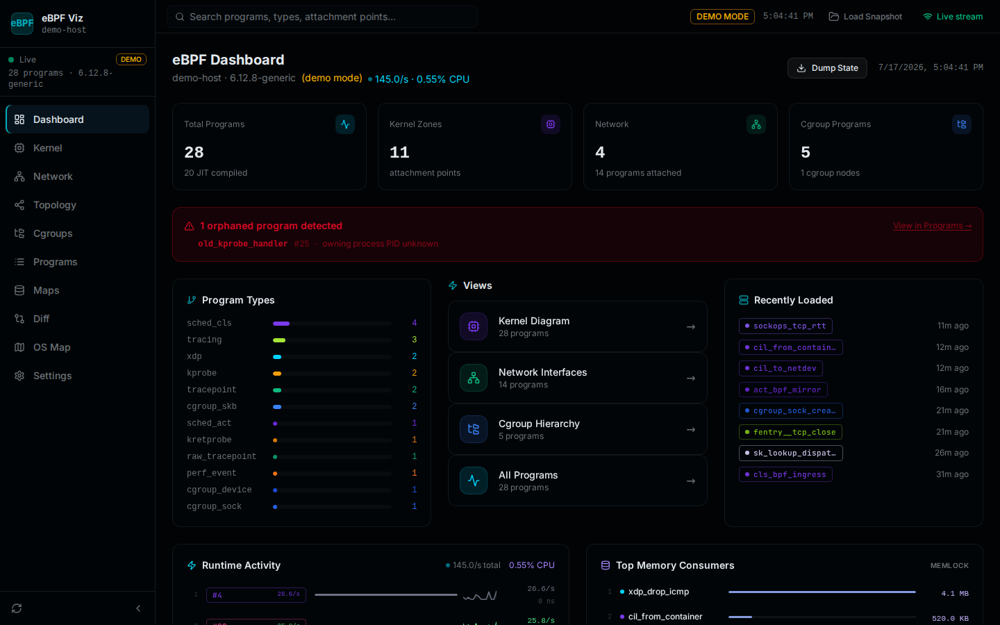
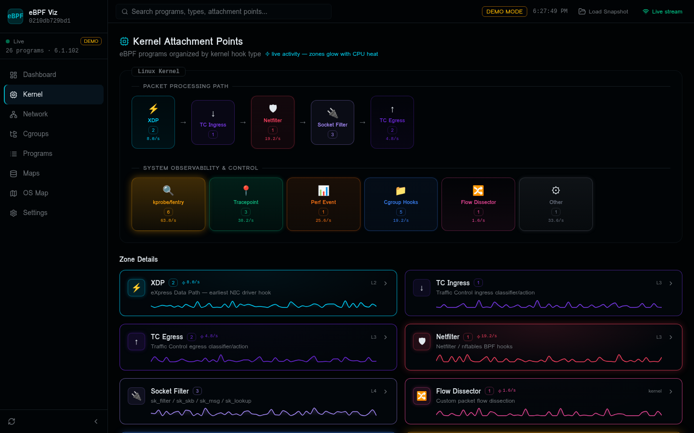
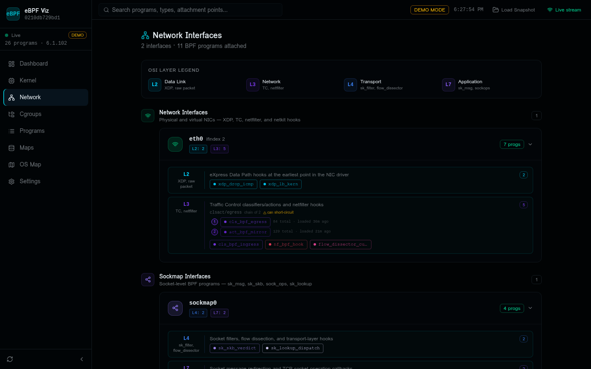
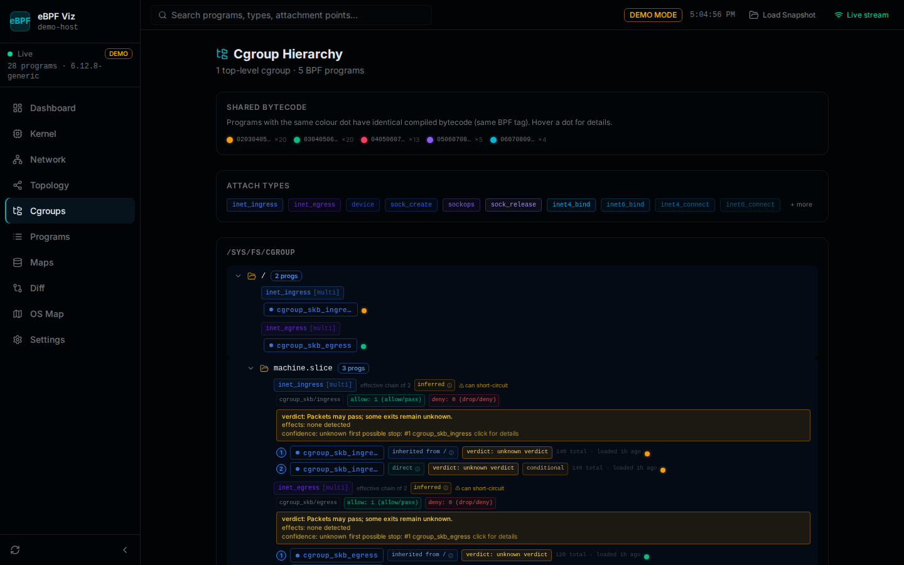
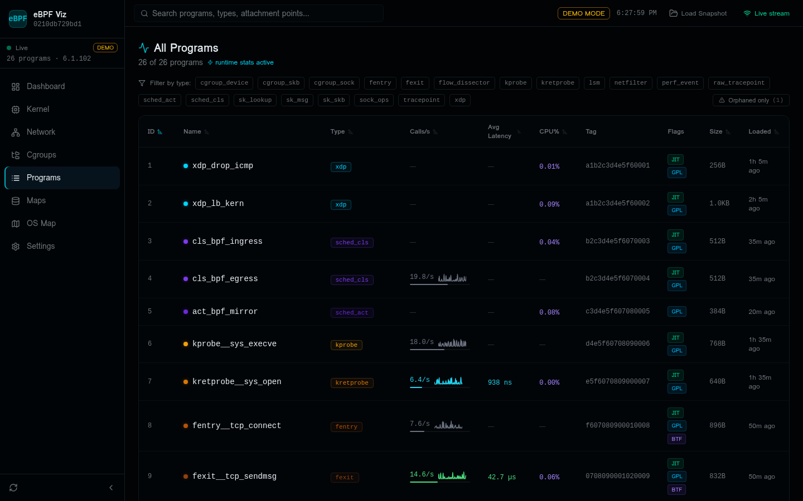
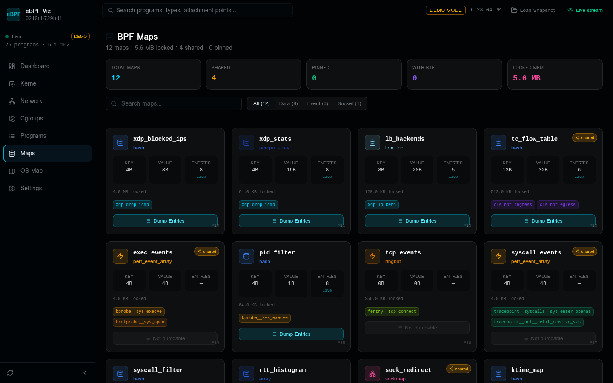
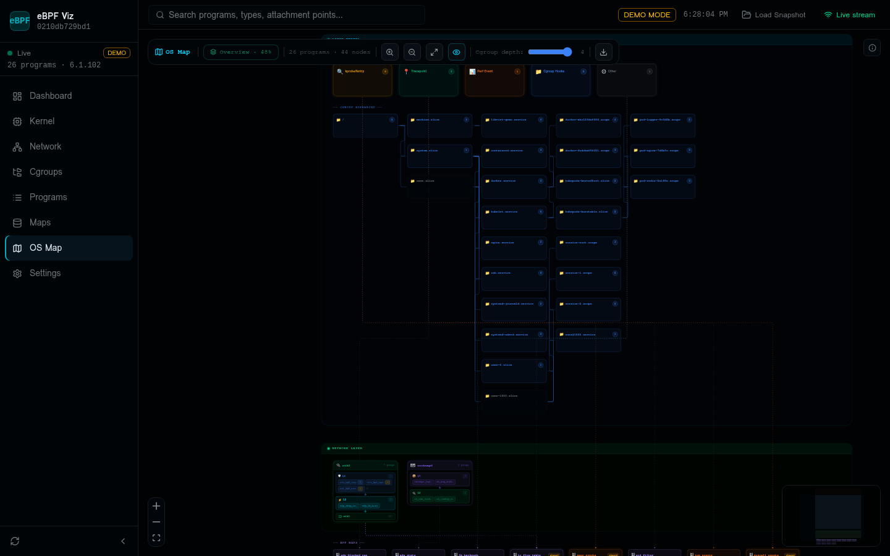
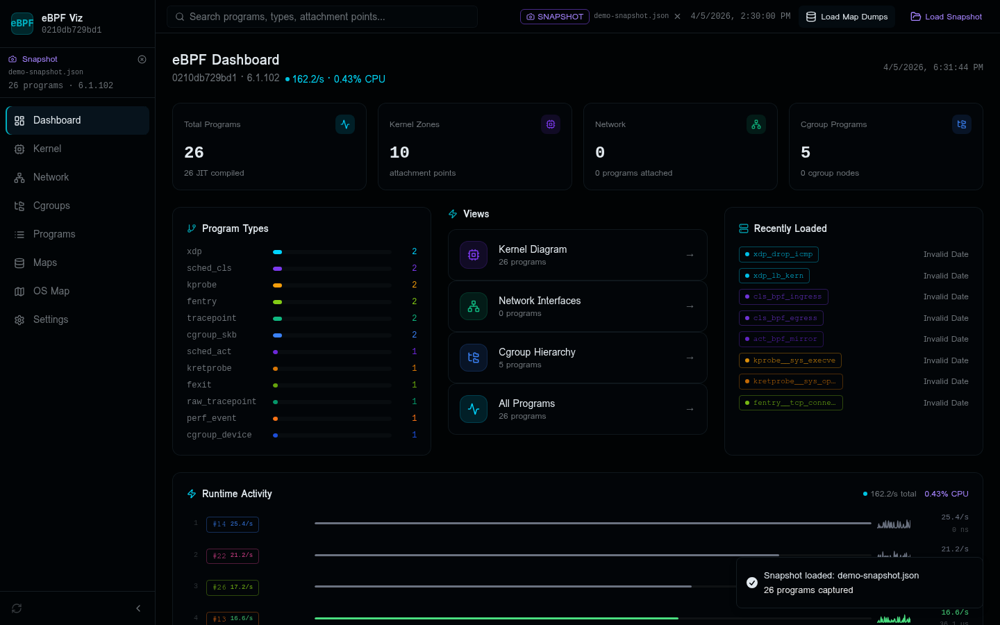

# eBPF Viz

A real-time web dashboard for visualizing eBPF programs running on a Linux kernel. The visualizer polls `bpftool` every 5 seconds and renders kernel attachment zones, network interfaces with OSI layers, cgroup hierarchies, an interactive OS Map canvas, and a Code Inspector with BPF bytecode and control-flow graphs.

**No database. No authentication. No external services required.**



---

## Features

The visualizer provides seven distinct views, each designed to answer a different question about the BPF programs running on a system.

| View | Description |
|------|-------------|
| **Dashboard** | Summary statistics, program type breakdown, orphaned program alerts, recently loaded programs, and runtime activity charts |
| **Kernel** | Attachment points organized by hook type — XDP, TC, Netfilter, Socket Filter, kprobe/fentry, Tracepoint, Perf Event, Cgroup Hooks, and more |
| **Network** | Physical and virtual NICs with BPF programs grouped by OSI layer (L2–L7), including TC chain order and sockmap interfaces |
| **Cgroups** | Full cgroup hierarchy tree showing which BPF programs are attached at each node, with shared-bytecode color coding |
| **Programs** | Sortable, filterable table of all loaded programs with live calls/sec sparklines, avg latency, CPU%, flags (JIT/GPL/BTF), and relative load time |
| **Maps** | BPF map inventory with key/value sizes, live entry counts, locked memory, and an interactive entry dump viewer with JSON/CSV export |
| **OS Map** | Interactive ReactFlow canvas showing the entire kernel topology — kernel zones, cgroup tree, network interfaces, and BPF maps — in a single scrollable diagram |

### Three Data Modes

| Mode | How it works | When to use |
|------|-------------|-------------|
| **Live** | Polls `bpftool` every 5 s via Server-Sent Events | Running directly on the target Linux host |
| **Demo** | Synthetic mock data with 26 realistic programs | Exploring the UI without a Linux host |
| **Snapshot** | Uploaded JSON file captured by `capture-snapshot.sh` | Inspecting production data on a local machine |

---

## Screenshots

### Dashboard

The main dashboard provides a high-level summary of the BPF subsystem. The **orphaned program banner** alerts you when a program has no owning process — a common indicator of a leaked program whose loader exited unexpectedly. The **Recently Loaded** sidebar shows programs sorted by load time with relative timestamps.


### Kernel Attachment Points

The Kernel view organizes programs by hook type within a stylized Linux kernel diagram. The **Packet Processing Path** shows the canonical XDP → TC Ingress → Netfilter → Socket Filter → TC Egress pipeline. Each zone card displays a live sparkline of call rate activity, and zones glow with color intensity proportional to CPU heat.



### Network Interfaces

The Network view groups programs by interface and OSI layer. TC classifiers are shown in **chain order** with a warning when a short-circuit action can prevent downstream programs from running. Sockmap interfaces (`sk_msg`, `sk_skb`, `sock_ops`, `sk_lookup`) appear in a separate section below the NIC list.



### Cgroup Hierarchy

The Cgroups view renders the full `/sys/fs/cgroup` tree. Programs with identical compiled bytecode (same BPF tag) share a color dot — hovering reveals the tag hash and the list of cgroups that share it. Attach types are shown as labeled chips, and each cgroup node can be expanded or collapsed.



### Programs Table

The Programs table lists every loaded BPF program with live runtime statistics. The **type filter chips** let you narrow to a specific program type. The **Orphaned only** chip (shown in red when orphaned programs exist) filters to programs whose owning process has exited. Each row includes a sparkline of calls/sec, average execution latency, CPU utilization percentage, and the relative time since the program was loaded.



### BPF Maps

The Maps view shows every BPF map with its type, key/value sizes, live entry count, and locked memory. Maps are categorized as Data, Event, or Socket. **Dump Entries** opens a modal with the full map contents, interpreted key/value pairs, and JSON/CSV export. Maps that cannot be iterated (`ringbuf`, `perf_event_array`) show a "Not dumpable" indicator.



### OS Map

The OS Map is a zoomable, pannable canvas that renders the entire kernel topology in one view. The **Cgroup depth slider** in the toolbar controls how many levels of the cgroup tree are rendered — nodes at the depth limit show a dashed badge indicating how many descendants are collapsed. The **Download** button exports the current topology as a re-uploadable snapshot JSON.



### Snapshot Mode

After loading a snapshot file, the toolbar switches to **SNAPSHOT** mode. The filename, capture timestamp, and a **Load Map Dumps** button appear in the top bar. The sidebar shows the snapshot hostname and kernel version. All views render the snapshot data identically to live mode. Click the **×** next to the filename to return to Live or Demo mode.



---

## Quick Start

### Option A — Standalone Tarball (recommended for devservers)

The standalone tarball bundles the compiled frontend and Express server into a single archive. The target machine needs only **Node.js ≥ 18** — no npm, no Docker, no internet access.

**1. Download the latest release:**

```bash
# Download from the GitHub Releases page
curl -LO https://github.com/mykola-lysenko/ebpf-viz/releases/download/latest/ebpf-viz-standalone.tar.gz
```

**2. Extract and start:**

```bash
tar -xzf ebpf-viz-standalone.tar.gz
cd standalone
sudo ./start.sh          # sudo required for bpftool access
```

Open `http://localhost:3000` in your browser.

**Demo mode (no bpftool required):**

```bash
DEMO_MODE=1 ./start.sh
```

See [DEPLOY.md](DEPLOY.md) for systemd service configuration, nginx reverse proxy setup, and environment variable reference.

---

### Option B — Docker

```bash
docker build -t ebpf-viz .

docker run --rm \
  --privileged \
  --pid=host \
  --network=host \
  -v /sys/fs/cgroup:/sys/fs/cgroup:ro \
  -v /sys/kernel/debug:/sys/kernel/debug:ro \
  -p 3000:3000 \
  ebpf-viz
```

> **Minimal-privilege alternative:** replace `--privileged` with `--cap-add=SYS_ADMIN --cap-add=SYS_PTRACE`. Some kernels also require `--cap-add=BPF` (Linux ≥ 5.8).

---

### Option C — Development Mode

```bash
git clone https://github.com/mykola-lysenko/ebpf-viz.git
cd ebpf-viz
pnpm install

# Live mode (requires bpftool + root)
sudo pnpm dev

# Demo mode (no kernel required)
DEMO_MODE=true pnpm dev
```

---

## Requirements

| Dependency | Version | Notes |
|---|---|---|
| Linux kernel | ≥ 5.1 | For `run_time_ns`/`run_cnt` stats; ≥ 4.15 for basic operation |
| Node.js | ≥ 18 | ≥ 22 recommended for development |
| pnpm | ≥ 10 | `npm install -g pnpm` |
| bpftool | ≥ 7.x | See [INSTALL.md](INSTALL.md) for build instructions |
| sudo | any | The server calls `sudo bpftool`; configure sudoers accordingly |

See [INSTALL.md](INSTALL.md) for full installation instructions including bpftool build from source, sudoers configuration, and distribution-specific notes.

---

## Enabling Runtime Statistics

To see calls/sec, avg latency, and CPU% per program, enable BPF stats on the host:

```bash
# Immediate (lost on reboot)
sudo sysctl -w kernel.bpf_stats_enabled=1

# Persistent across reboots
echo 'kernel.bpf_stats_enabled=1' | sudo tee /etc/sysctl.d/90-bpf-stats.conf
sudo sysctl -p /etc/sysctl.d/90-bpf-stats.conf
```

The visualizer attempts to enable this sysctl automatically at startup when it has the necessary permissions. Stats only accumulate **after** the sysctl is set — programs loaded before that point will show zero until they are reloaded.

---

## Snapshot Workflow

The snapshot workflow lets you capture a point-in-time view of BPF programs from a production server and visualize it on your local machine — without installing the full eBPF Viz on the production host.

### Step 1 — Capture

Copy `capture-snapshot.sh` to the production server and run it as root. The script requires only `bash` and `bpftool` — no `jq`, Python, or Node.js.

```bash
# Basic snapshot (programs, maps, network, cgroups)
sudo bash capture-snapshot.sh

# With map contents (larger file, requires bpftool map dump)
sudo bash capture-snapshot.sh --dump-maps
```

The script outputs two files:

- `ebpf-snapshot-<hostname>-<YYYYMMDD-HHMMSS>.json` — topology snapshot (~0.3 MB typical)
- `ebpf-mapdumps-<hostname>-<YYYYMMDD-HHMMSS>.json` — map entry contents (size varies; only with `--dump-maps`)

### Step 2 — Transfer

```bash
scp user@myserver:/path/to/ebpf-snapshot-myserver-20260312-151100.json ~/Downloads/
# Optionally also transfer the map dumps file
scp user@myserver:/path/to/ebpf-mapdumps-myserver-20260312-151100.json ~/Downloads/
```

### Step 3 — Load in the UI

1. Open eBPF Viz in your browser.
2. Click **Load Snapshot** (folder icon) in the top-right toolbar.
3. Select the `ebpf-snapshot-*.json` file.
4. The UI switches to **Snapshot mode** — a `SNAPSHOT` badge appears with the capture timestamp and hostname.
5. Optionally, click **Load Map Dumps** to load the companion `ebpf-mapdumps-*.json` file, which enables the **Dump Entries** button on each map card.

### Snapshot File Format

```json
{
  "_ebpfVizSnapshot": true,
  "capturedAt": "2026-03-12T15:11:00Z",
  "hostname": "myserver",
  "kernelVersion": "6.8.0-51-generic",
  "bpftoolVersion": "7.4.0",
  "raw": {
    "progs":   [ ... ],
    "maps":    [ ... ],
    "net":     [ ... ],
    "cgroups": [ ... ]
  }
}
```

Snapshots exported via the **Download Topology JSON** button in the OS Map toolbar use the same format and can be re-uploaded directly.

---

## Configuration

All settings are provided as environment variables (or in a `.env` file). No database URL, auth tokens, or API keys are required.

| Variable | Default | Description |
|---|---|---|
| `PORT` | `3000` | HTTP listen port |
| `BPFTOOL_PATH` | auto-detected | Absolute path to the `bpftool` binary |
| `DEMO_MODE` | `false` | Use synthetic mock data instead of live `bpftool` |
| `POLL_INTERVAL_MS` | `5000` | Polling interval in milliseconds (1000–60000) |
| `BPF_STATS_ENABLED` | auto | Set to `0` to skip enabling BPF runtime stats at startup |

---

## Development

```bash
# Install dependencies
pnpm install

# Start dev server (with hot reload)
DEMO_MODE=true pnpm dev

# Run tests
pnpm test

# Type check
pnpm typecheck

# Build standalone tarball
bash build-standalone.sh
```

### Project Structure

```text
client/
  src/
    pages/          <- Page-level components (Dashboard, KernelView, etc.)
    components/     <- Reusable UI components (OsMapCanvas, MapEntriesModal, etc.)
    contexts/       <- EbpfContext (snapshot state, demo/live/snapshot mode)
    lib/            <- Utilities (time formatting, tRPC client)
server/
  ebpf-poller.ts   <- bpftool polling and SSE stream
  ebpf-parser.ts   <- Raw bpftool output -> EbpfSnapshot model
  ebpf-mock.ts     <- Synthetic demo data generator
  routers.ts       <- tRPC procedures (snapshot, maps, programs, etc.)
shared/
  ebpf-types.ts    <- Shared TypeScript types
capture-snapshot.sh <- Production snapshot capture script
build-standalone.sh <- Standalone tarball builder
```

### Running Tests

The test suite uses Vitest for unit tests:

```bash
pnpm test           # run all tests
pnpm test --watch   # watch mode
```

---

## CI/CD

A GitHub Actions workflow (`.github/workflows/release.yml`) triggers on every push to `main`. It installs dependencies, runs the full test suite, builds the standalone tarball, and publishes it as a rolling `latest` pre-release on GitHub Releases. A failing test suite prevents the release from being published.

---

## Troubleshooting

**Demo mode shows instead of live data**

The poller fell back to mock data. Check the server log for the reason. Common causes: `bpftool` not found at `BPFTOOL_PATH`, sudo permission denied, or kernel too old (< 4.15).

**`bpftool: command not found`**

Install `bpftool` for your distribution:

| Distribution | Install command |
|---|---|
| Fedora / RHEL 9+ | `sudo dnf install bpftool` |
| Debian / Ubuntu | `sudo apt install linux-tools-common linux-tools-$(uname -r)` |
| Arch Linux | `sudo pacman -S bpf` |

Or build from source — see [INSTALL.md](INSTALL.md).

**Permission denied reading BPF maps**

The server must run as root or with `CAP_BPF + CAP_SYS_ADMIN`. Use `sudo ./start.sh` or configure a sudoers entry — see [INSTALL.md](INSTALL.md) for details.

**"Not a valid eBPF Viz snapshot file" error**

The uploaded file must have `"_ebpfVizSnapshot": true` at the top level. Use `capture-snapshot.sh` to generate the file, or export a topology from the OS Map's Download button.
