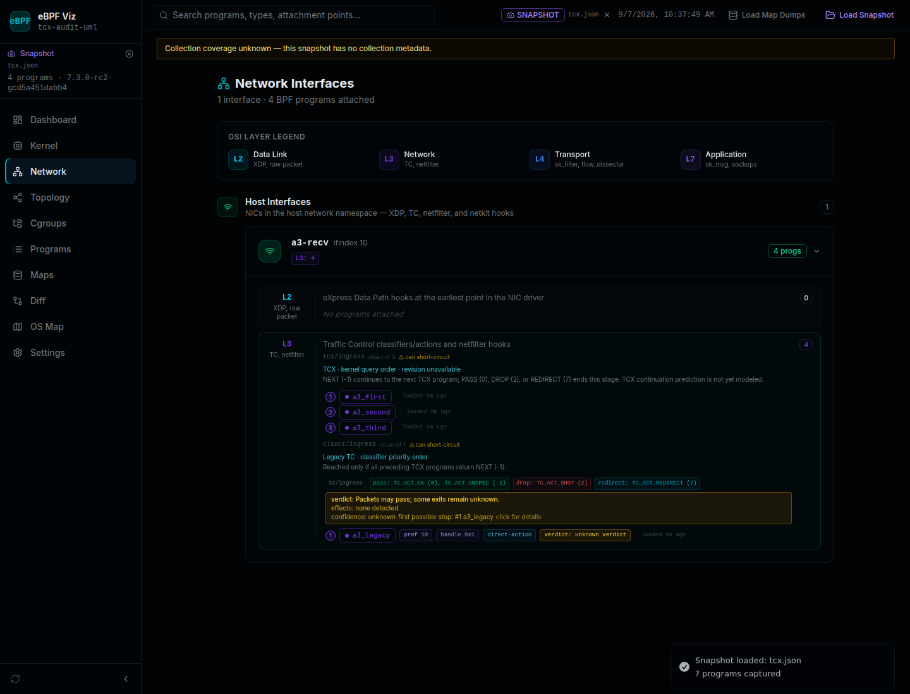

# TCX ordering audit — A.3

Date: 2026-09-07. Status: audit and reproduced parser/UI fixes complete locally.

## Verdict

The native bpftool 7.8 capture retains all three TCX attachments and their
execution order when detailed legacy TC filters are present. The suspected
native attachment loss and ID-based reordering were **not reproduced**.

The audit did reproduce narrower application problems:

| Case | Before | Result after the fix |
|---|---|---|
| Native TCX rows inside `net.tc` | Attachment kind labeled `tc` | Labeled `tcx`, distinct from legacy TC |
| Supported separate `net.tcx` input | NIC programs present, chain omitted | Chain retained; query-shaped rows preserve order |
| Namespace-scoped network captures | No namespace chains generated | Chains scoped by namespace and interface |
| Coarse legacy rows or TCX rows without query identity | Positions could imply known order | Order unknown; no sequence-based path prediction |
| Mixed TCX and singleton legacy TC | TCX chain and unqualified loose legacy program | Separate stages; legacy labeled conditional on all TCX returning NEXT |
| TCX continuation | Could use legacy TC pass/continue model | Continuation prediction explicitly unavailable |

The separate-array and namespace cases are regression transformations of the
real captured payload, not claims that bpftool 7.8 emits a separate `tcx` array.
No kernel TCX defect was found. This is a bounded audit of the tested guest and
tool versions, not validation of every kernel/tool combination.

## Reproduction and evidence

Host inspection found Linux `6.18.33.2-microsoft-standard-WSL2+`, bpftool 7.8.0
with libbpf 1.8, and iproute2 6.1. Host sudo requires a password, so no host BPF
or networking state was modified. Reproduction ran as guest root in an installed
UML kernel, with a disposable veth pair and fd-owned BPF objects.

Guest: `7.3.0-rc2-gcd5a451dabb4`, a patched local bpf-next build. Local source
HEAD was `cd5a451dabb439eab2d4375dc9e94f18104fc037`; its upstream base recorded
by the build was `1b7415bf7`. Kernel executable SHA-256:
`6c2a73a4909d7f22c654c5f51537435543ae4cc0cf530f8fc659aa4e475f71c5`.

The [loader and runner](../lab/tcx-audit/README.md) use the lab's existing
cilium/ebpf 0.22.0 and netlink 1.3.1 versions. Programs are loaded in reverse
execution order, then attached using Head and AfterLink anchors. A shared map
records each stage for a synthetic Ethernet frame. Every case queries program
order and revision before collecting bpftool and detailed TC output.

| Case | Queried program IDs, in order | Revision | Recorded packet stages |
|---|---|---|---|
| Ingress, all TCX NEXT | 4, 3, 2 | 1 → 4 | 1234 |
| Ingress, second TCX PASS | 35, 34, 33 | 1 → 4 | 12 |
| Egress, all TCX NEXT | 66, 65, 64 | 1 → 4 | 1234 |
| Egress, second TCX PASS | 97, 96, 95 | 1 → 4 | 12 |

Stages 1–3 are TCX, stage 4 is legacy TC. NEXT is `-1`; PASS is `0`.
The PASS cases demonstrate that both the third TCX program and legacy TC are
skipped. These are measured packet executions, not inferred return analysis.
DROP and REDIRECT behavior is source-checked, not separately exercised here.

[Fixture directory](../server/fixtures/tcx-audit/) contains four importable
snapshots and their query/execution evidence. The JSON envelopes include kernel
and bpftool versions copied from each run's evidence; raw command output is
unchanged. The runner checks actual IDs/order each run, so future captures do
not depend on these numeric IDs staying fixed.

## Primary-source checks

- [bpftool network collection](https://github.com/libbpf/bpftool/blob/main/src/net.c):
  `__show_dev_tc_bpf()` emits the BPF_PROG_QUERY arrays in their returned order,
  with `prog_id` and `link_id`. `do_show()` places TCX and classic TC in the
  same JSON `tc` array. This shape and order were confirmed with bpftool 7.8.
- [Linux network execution](https://github.com/torvalds/linux/blob/v6.18/net/core/dev.c):
  `tcx_run()` walks TCX programs until the result is not NEXT. Both ingress and
  egress invoke classic `tc_run()` only after TCX returns NEXT. The tested
  guest's corresponding implementation was inspected as well.
- [TCX API definitions](https://github.com/torvalds/linux/blob/v6.18/include/uapi/linux/bpf.h)
  and [cilium/ebpf query implementation](https://github.com/cilium/ebpf/blob/v0.22.0/link/query.go):
  the query exposes program/link identities and a revision. The measured
  revision increased by three for three attachments.

The queried revision is **not emitted by bpftool net JSON**. The ordinary
collector therefore displays “revision unavailable”; it does not invent a
revision from array length or link IDs. The audit saves the independent query
revision in its evidence files. A production query collector is further work.

The bpftool source also returns silently from failed per-hook queries. A
successful top-level command alone cannot prove every optional hook was
queryable. The audit confirms the populated TCX case by independent query and
packet execution; it does not claim an empty `tc` array proves TCX support or
complete absence. A.1 collection warnings remain applicable.

## Application behavior and remaining scope

TCX ordering evidence comes from native query-shaped rows (`prog_id`, TCX hook
and direction) in their recorded order. It is never reconstructed from sorted
program IDs, link IDs, or program-list order. The accepted alternate `tcx`
array uses the same rules. Missing program inventory or non-query shapes leave
order unknown. Detailed classic TC rows use classifier priority/order evidence;
coarse classic TC rows remain unverified.

Network cards distinguish TCX and legacy TC and keep namespace scopes separate.
Unknown order uses question-mark positions and suppresses path predictions and
adjacent-program rate comparisons. Snapshot mode also suppresses live rate
comparisons so cached live/demo IDs cannot contaminate imported captures.
Older parsed TC captures without ordering
evidence remain unverified. Export/import preserves the new chain metadata.

TCX PASS terminates the TCX stage; treating it as generic continuation would be
incorrect. This change deliberately leaves TCX continuation prediction
unavailable until that behavior is modeled. Netkit is not treated as a TC
classifier chain. Broader netkit execution modeling and a production revision
query collector remain in the ecosystem plan.

## Browser reproduction

Load `server/fixtures/tcx-audit/ingress-next.json`, open Network, and inspect
`a3-recv`: three TCX programs appear in query order, with unavailable revision,
followed by conditional legacy TC. Repeat with an egress capture for `a3-send`.
The optional evidence JSON is an audit record, not an application snapshot.

Regression tests cover all four captures against their query evidence, the
alternate array shape, namespace scoping, missing inventory, netkit separation,
unknown ordering, and suppression of the legacy TC prediction model for TCX.

Validation: 583 automated tests passed, plus typecheck, lint, production and
standalone builds. Chromium verified ordering, conditional legacy TC, unknown
positions, namespace scoping, export/reimport, and suppression of cached live
rates in imported captures. The final standalone tarball passed its Node
16.20.2 smoke test. The checked-in UML runner independently reproduced all four
packet tests.
